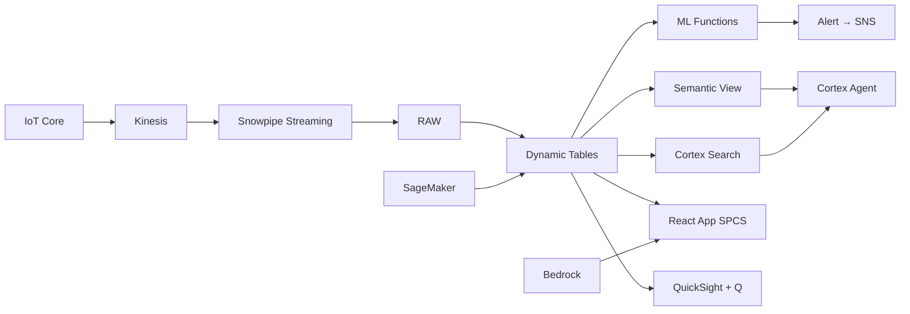

# Precision Farming & Crop Analytics

Precision farming intelligence for Thailand's rice, sugarcane, and fruit plantations — IoT sensors feed Snowflake ML for yield forecasting, SageMaker vision models via Cortex Complete analyze crop imagery, and ML.FORECAST predicts harvest timing.

## Architecture

Thailand's agricultural conglomerate manages 85 farms growing rice, sugarcane, and tropical fruits across 2,400 field blocks. Traditional farming relies on delayed satellite reports and manual field visits — missing moisture stress, disease outbreaks, and yield opportunities worth ฿280M annually. Precision farming with IoT sensors, crop imagery AI, and ML yield forecasting closes the gap.



## Snowflake Capabilities

| Capability | Implementation |
|-----------|---------------|
| Dynamic Tables | FIELD_HEALTH_STATUS / YIELD_TIMESERIES / IRRIGATION_RECOMMENDATIONS / PEST_DISEASE_ALERTS |
| ML Functions | ML.FORECAST + ML.ANOMALY_DETECTION |
| Cortex AI | COMPLETE_MULTIMODAL, COMPLETE, AI_CLASSIFY |
| Cortex Search | 15000 documents indexed |
| Cortex Agent | PRECISION_FARMING_AGENT |
| Semantic View | FARMING_ANALYTICS |
| React App (SPCS) | 5 tabs + DemoGuide |


## AWS Services

| Service | Role in Demo |
|---------|-------------|
| AWS IoT Core | Ingest field sensor data (soil moisture, temp, rainfall) — 1.5M readings |
| Amazon SageMaker | Crop disease detection from drone/satellite imagery (vision model) |
| Amazon Kinesis | Stream weather station data for real-time irrigation decisions |
| Amazon Bedrock (Claude) | Generate agronomist recommendations and seasonal reports |
| Amazon SNS | Alert agronomists on crop stress and disease detection |
| Amazon QuickSight + Q | Farm management dashboard with NL queries |


## Personas

| Persona | Role | Key Questions |
|---------|------|---------------|
| **Suraphon Charoensuk** | Chief Agricultural Officer | "What's our predicted yield vs target across all farms?" "Which regions face the highest climate risk this season?" |
| **Chanida Thongsaen** | Senior Agronomist | "Which fields have moisture stress right now?" "Show me the NDVI trend for Block-47 this season." |


## Data

| Table | Rows | Description |
|-------|------|-------------|
| FARMS | 85 | Contract and owned farms across 3 regions (rice, sugarcane, durian, mango) |
| FIELD_BLOCKS | 2,400 | Individual field blocks with crop type, area, and soil profile |
| SENSOR_READINGS | 1,500,000 | IoT soil moisture, temperature, humidity, rainfall sensors (hourly) |
| SATELLITE_INDICES | 72,000 | NDVI, EVI vegetation indices from satellite imagery (weekly × blocks) |
| CROP_IMAGERY | 15,000 | Drone and satellite crop images for disease/pest detection |
| HARVEST_RECORDS | 9,600 | Historical yield data by block and season (4 seasons × 2400 blocks) |
| WEATHER_STATIONS | 250,000 | Local weather data (temperature, rainfall, wind, solar radiation) |
| THAI_AGRICULTURE | 10 | Thailand agriculture sector statistics |


## Build Instructions

### Prerequisites
- Snowflake account with ACCOUNTADMIN access
- Cortex AI enabled (ML Functions, Search, Agent)
- Warehouse: FARMING_WH (Medium)
- AWS CLI with access (us-west-2)

### Deployment

```bash
snowsql -f snowflake/00_setup.sql
snowsql -f snowflake/01_marketplace_install.sql
snowsql -f snowflake/02_raw_tables.sql
snowsql -f snowflake/03_staging.sql
snowsql -f snowflake/04_dynamic_tables.sql
snowsql -f snowflake/05_search.sql
snowsql -f snowflake/06_ml_models.sql
snowsql -f snowflake/07_semantic_view.sql
snowsql -f snowflake/08_agent.sql
```

### React App (SPCS)
```bash
cd app && npm ci && npm run build
docker build -t aws-thailand-food-precision-farming-app .
docker push bdiqc8sm-default.registry.snowflakecomputing.com/precision_farming/app/aws_thailand_food_precision_farming/app:latest
```

### Demo Mode
Open the app URL with `?demo=true` for presenter view.

## Build Modes

### Snowflake Only
Run scripts 00-08 (skip AWS-specific integration). Uses:
- **Snowpipe Streaming SDK** instead of AWS IoT Core
- **Cortex Complete (multimodal)** instead of Amazon SageMaker
- **Snowpipe Streaming SDK (direct)** instead of Amazon Kinesis
- **Cortex Complete** instead of Amazon Bedrock (Claude)
- **Alerts + Notification Integration** instead of Amazon SNS
- **Snowflake Intelligence (Cortex Analyst)** instead of Amazon QuickSight + Q

### Full AWS + Snowflake
Run all scripts including AWS integration. Deploy QuickSight dashboard from `quicksight/`.

## Business Impact

Industry research and Snowflake customer outcomes:
- **Thailand's agriculture sector contributes ฿1.4 trillion to GDP, employing 12 million people (31% of workforce)** — [Bank of Thailand](https://www.bot.or.th/en)
- **Precision agriculture increases crop yields by 15-25% while reducing water and fertilizer use by 20-30%** — [McKinsey Agriculture](https://www.mckinsey.com/industries/agriculture/our-insights)
- **AI-powered crop disease detection achieves 90%+ accuracy and detects outbreaks 7-14 days earlier** — [Nature Food](https://www.nature.com/natfood/)
- **CP Group (Thailand) manages 400,000+ rai of integrated farms using smart agriculture technology** — [CP Group](https://www.cpgroupglobal.com/en)
- **Foodics** (Snowflake customer): built a unified data platform on Snowflake powering supply chain and demand forecasting across 200+ brands -- [snowflake.com/customers/foodics](https://www.snowflake.com/en/customers/all-customers/case-study/foodics/)

## Key Demo Numbers

- **฿280M** potential yield shortfall vs target (US$8M)
- **23% of blocks** showing moisture stress in Isaan (drought risk)
- **87% accuracy** yield forecast within 10% of actual at 60 days
- **1.5M readings** IoT sensor data points ingested monthly
- **15,000 images** analyzed by multimodal Cortex Complete for disease detection
- **2,400 blocks** monitored with per-block yield predictions


## License

Apache 2.0 — See [LICENSE](LICENSE) for details.

This is a personal demo project and is not an official Snowflake offering. It comes with no support or warranty.